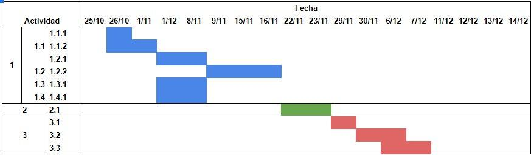

#Datathon Description

***Research Objetive:*** Definition of the zones and daytime hours in which it is more common the use of each type of transport system based on the influence of weather, income, and age?

**Phases identified at (2019-10-25):**
 
1. Data Preparation:
    * Identify variables to use from the data
        * Weather:
        * Areas represented by points
            1. NYC open data
            2. Interpolate. (Minimum inverse distance method)
        * ETA and cleaning of transport data (Date, Geographic Location):
            1. Uber 2014, Uber 2015
            2. yellow taxi
            3. green taxis
            4. MTA
        * Demographic data
        * NTA zones
2. Cross transport data with:
        * weather
        * zones (Location_id, NTA code)
        * demographics
3. Analytics

**Actividades a desarrollar:**

1. Prepare data:
    * Identify dates in common
        * All layers
        * Define the date range that is common to all means of transport for analysis

    * Weather

        * Data cleaning (nulls, outliers, etc.)
        * Perform interpolation of data for the entire defined date range.
            1. max_temp
            2. min_temp
            3. avg_temp
            4. precipitation
            5. snowfall
            6. snow_depth

    * Transport data
        * Data cleaning (nulls, outliers, etc.)
    * Demographic and Zone Data
        * Data cleaning (nulls, outliers, etc.)

2. Cross data
    * Analysis of how to make the crosses (Space and Alphanumeric)
3. Analytics
    * Define the metrics to display
    * Make dashboards with defined metrics for the different hierarchies (Station, month, day, time)
    * Analysis depth per hour

Dashboard with aggregation filters of season, month, day and hour. The dashboard will include the relevant metrics for answering in which zones and daytime hours is more common the use of each type of transport system. The metrics will be defined upon the analysis and trends that we found during the development of the project.

#Final Project Description

***Introduction***

User experience have shown that information of the pricing in real state is derivative and uncertain. It is a challenge for sellers to know what is a good price for selling their properties and also for user's to know if they are getting a good or bad deal. Last year's economic situation have shown that there is a lot of inventory and that people are not buying new properties. This results in a decrease on the economic growth, as construction companies are slowing and decreaseing their investment in new projects.

***General Question:*** What is the influence of  specific input (For Example Infrastructure, education, security) in the price of housing in Bogotá?

***Datasets***

We will use different sources for the different objectives that we have:

For information about the housing offers: Metrocuadrado, fincaraiz, olx, Mercadolibre, Properati

For social data: Dane, police website, Iboca

For transportation: Uber data and Spatial Data Infrastructure of Bogotá

For Infrastructure and local information: Bogotá mi Ciudad.

**Computation**

The first challenge will be to filter, join and clean all the data from the whole different sources. We will use Web Scrapping, Join the information with SQL and use Python Pandas for cleaning and organizing the data.

Secondly we will use a multivariate analysis to understand the most important features of the model that should be created.

Based on all the information, EDA, understanding of the features; we will determine the best model to use for the predictive pricing.

**Scope**

**Version 1:** A Geographic Dashboard of Bogotá that visualizes the selected main feature's influence. 

**Version 2:** A Geographic Dashboard with filters and slicers based on categorization and clusterings

**Version 3:** A System's recommendation engine that takes the real live input of a user, and delivers the best possible recommendation for it.

***Additional Questions We would like to answer***

* The current pricing of the residential real state business in Bogotá is based mainly on which variables?
* How to identify the best areas to buy according to user’s preferences?
* Can the change in price of housing in Bogotá be predicted based on new inputs? (Infrastructure, education, security)
* If I have one point to live which is the shortest distance to college, highschool, supermarket, pub, theater, gym, kindergarten (points of interest).
